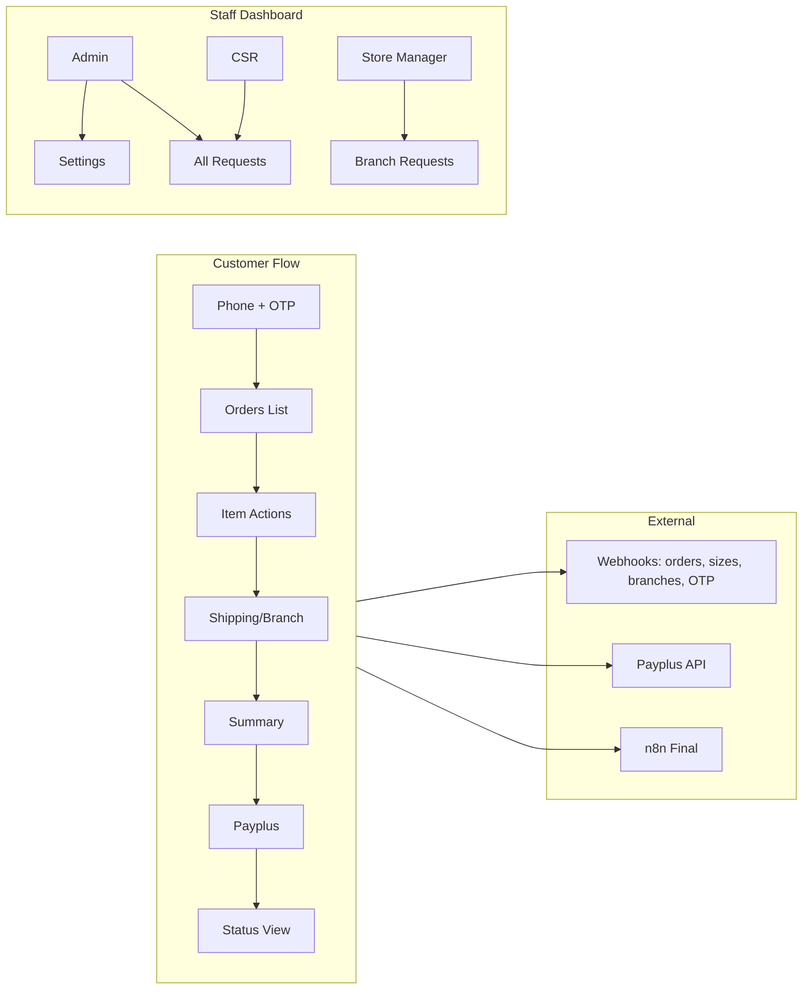

# Returns Hub — Full Implementation Plan

## Architecture summary

- **Stack:** Next.js 14 (App Router), Supabase (DB + Auth for staff), Vercel. External: your n8n webhooks (orders, sizes, branches, OTP send, final payload), Payplus API (create payment + success webhook).
- **Two audiences:** (1) **Customers** — phone/OTP, then return flow; (2) **Staff** — Admin / Customer Service Representative / Store Manager with role-based access.
- **Data:** Supabase is source of truth for return requests, status, app settings, staff users and roles. Orders/sizes/branches come from your webhooks; we compute eligibility and totals in the app.

---

## 1. Data model (Supabase)

**Tables to add (via migrations or SQL):**

- `**app_settings`** (singleton-ish): `eligibility_days` (int), `return_reasons` (jsonb array of strings), `shipping_tiers` (jsonb array of `{ min, max, fee }`), `otp_webhook_url`, `orders_webhook_url`, `sizes_webhook_url`, `branches_webhook_url`, `final_webhook_url`, `payplus_`* config if not in env. Optional: one row per “scope” or use env for URLs and only store business settings.
- `**return_requests`**: `id` (uuid, PK), `return_id` (unique, human-readable for customer), `phone`, `order_id` (from your API), `branch_id` (from branches webhook), `status` (enum: pending_approval, confirmed, pickup_awaiting, received, refunded for returns; awaiting_payment, confirmed, shipped, in_transit, delivered for replacements), `type` (return | replacement), `items` (jsonb: product sku, action, selected_size_id if replace, reason_id if return), `amount_refund`, `amount_to_pay`, `shipping_fee`, `payplus_payment_id` / `payment_status`, `confirm_token` (unique, for manager link), `created_at`, `updated_at`. If one request can mix return + replace, `type` might be “mixed” or we store per-item action and derive.
- **return_requests** also: `replacement_order_id` (from n8n response for replace — ERP order id to display); `customer_address` (jsonb, full contact/shipping when payment + delivery).
- `**staff_users`** (or Supabase Auth + `profiles`): `id`, `email`, `password_hash` (if custom) or use Supabase Auth; `**staff_roles`**: `user_id`, `role` (admin | csr | store_manager), `branch_id` (nullable; required for store_manager). Admin: no branch_id; Store Manager: one branch_id.
- **No `otp_codes` table:** OTP is fully external — your API sends the code (e.g. via WhatsApp) and your API verifies it; the app only triggers “send” and calls “verify” with phone + code. We do not generate or store OTP.
- **No orders table:** Orders list is always from your external API; we do not persist orders in our DB. We fetch when the user opens the orders step.
- **app_settings content fields (jsonb):** `content_banner`, `content_footer`, `content_help_banner` (text + href), `content_headlines` — editable in Settings for top banner, footer, “Need Help?” block, and page headlines.

**Eligibility:** When loading orders from your API, filter: `IVDATE` within last `eligibility_days` AND no row in `return_requests` for that `order_id` (and same phone if you need). Disable “החלפה/החזרה” for orders that don’t pass.

---

## 2. Customer flow (step-by-step)

- **Phone entry** — We call your **external “send OTP” API** (e.g. POST `phone`); **your side** sends the code to the customer (e.g. via WhatsApp). The app does not generate or store the code. Show “קוד נשלח” and OTP input screen.
- **OTP verify** — User enters the code they received. We call your **external “verify OTP” API** with `phone` + `code`; you return valid/invalid. On valid we create session (JWT or encrypted cookie) with `phone` and redirect to orders. **Dev bypass:** if user enters `0000`, treat as valid and log in without calling your verify API.
- **Orders list** — **Always from your external API:** we POST `phone` to your orders API when the user opens this step; get `orders[]` (and **customer details** for pre-fill). We do not store orders in our DB. For each order compute eligible (IVDATE + no existing return_request in our DB); show only “החלפה/החזרה” for eligible orders. **View invoice:** each order has “צפה בקבלה” — GET to your **invoices API** with `IVNUM`; you return a link (href); button opens that URL in new tab.
- **Item selection** — For each line: dropdown “Return” vs “Replace”. If Replace: POST SKU to sizes webhook, show “Sizes” (with prices); user picks size. If Return: pick reason from Settings `return_reasons`. Persist choices in wizard state (no DB yet).
- **Shipping / branch** — POST or GET branches webhook; show “שליח עד הבית” (fee from shipping_tiers by basket range) vs **“החזרה לסניף / איסוף עצמי”** (return or replace at store to avoid shipping costs). User picks branch from list. **Branch contact display:** when a branch is selected (and on summary/confirmation), show that branch’s contact info clearly: address, phone, opening hours, and optional map link so the customer knows exactly where to go. Branches webhook response should include at least: `id`, `name`, `address`, `phone`, `opening_hours` (or equivalent); optional: `map_url`. Store chosen branch in wizard state.
- **Summary** — Compute: per-item refund/top-up from order + sizes prices; add shipping from `shipping_tiers` by basket total; show “סה״כ לתשלום” / “זיכוי”. **When payment is involved and delivery was chosen:** user must fill out full contact/shipping address (all fields required). Pre-fill from **Customer Details** returned in the first (orders) webhook; user can edit. Store address in wizard and in `return_requests.customer_address` when creating the request. If no payment or branch chosen, only minimal contact if needed.
- **Payplus** — Server action or API route: body per your Payplus spec (amount, return_id, customer info); POST to Payplus API; receive `payment_link`; redirect user to Payplus. Store `return_request` in DB with status `awaiting_payment` (replacement) or keep “pending” until payment/approval flow is clear.
- **Payplus success** — Payplus calls our webhook (e.g. `POST /api/webhooks/payplus`). We verify signature/body, find `return_requests` by payment id, set payment_status and status (e.g. confirmed or next step); then POST full payload to your final n8n webhook (return_id, items, customer, status, etc.).
- **Confirmation page** — After redirect back from Payplus: show “תודה”, display `return_id` (and for **replace**: display `replacement_order_id` from n8n when provided), link to “צפייה בסטטוס”.
- **Once request is filed → n8n webhook and response:** When the return/replace request is created (after payment for replacement, or on submit for return-only), we POST full request data to your n8n webhook. **Response:** for **replace** you return `{ "orderID": "..." }` (ERP replace order id); we store as `replacement_order_id` and display to customer. For **return** you return e.g. `{ "status": "awaiting_confirm" }` (email to manager will be sent); we set status and show “ממתין לאישור” (or similar). We handle both response shapes and persist accordingly.
- **Manager confirm (returns)** — Email sent by n8n (using our payload) contains link to our app: `https://our-app.com/confirm-return?token=<confirm_token>`. Route `GET /confirm-return?token=...`: validate token, set `return_requests.status = 'confirmed'`, show “אושר” to manager. Token stored in `return_requests.confirm_token` when we create the request and send it in the final webhook payload to n8n.

**Status page (customer):** After auth (phone + OTP), list all `return_requests` for that `phone` with current status (Hebrew labels). Optional: deep link by `return_id` with token so they can share/bookmark.

---

## 3. Staff dashboard and roles

- **Auth:** Supabase Auth (email + password) for staff only. On login, load role from `staff_roles` (and `branch_id` for Store Manager).
- **Admin:** Can open Settings; can browse all return requests; can apply actions if you define them (e.g. mark “received” / “refunded”). Settings: eligibility_days, return_reasons (list), shipping_tiers (min/max/fee rows), webhook URLs if stored in DB.
- **CSR:** Same dashboard as Admin for browsing (all requests), no Settings, no action buttons (or read-only).
- **Store Manager:** Dashboard filtered by `branch_id` matching his role; can open manager confirm link (or same confirm page with token); no Settings, no global list.
- **UI:** One “Staff” area (e.g. `/staff`): login → role-based layout (sidebar: “Requests”, “Settings” only for Admin). **All requests view:** show all requests **grouped or filterable by Branch**, with statuses and full context (return_id, phone, order_id, branch name, status, type, amounts, created_at, replacement_order_id when relevant). Filters by status/type/branch; detail view per request. Admin/CSR see all branches; Store Manager sees only their branch.

---

## 4. Settings page (Admin only)

- **Eligibility (x days):** Number input, save to `app_settings.eligibility_days`.
- **Return reasons:** Dynamic list: add/remove/edit Hebrew labels; save as array to `app_settings.return_reasons`.
- **Shipping fee by basket range:** List of rows: min (₪), max (₪), delivery cost (₪). Add/remove rows; save to `app_settings.shipping_tiers`. Calculation in summary: sum of (item refund/top-up), then look up tier by that total (or by order subtotal — clarify once) and add shipping fee.
- **Webhook URLs (optional):** If you want them editable in UI: otp, orders, sizes, branches, final, Payplus base URL. Otherwise keep in env.
- **Configurable content (Admin):** Editable in Settings so you can change copy and links without code deploy:
  - **Top banner** — HTML or rich text / image URL; show above main content.
  - **Footer elements** — Text, links, or blocks; configurable structure.
  - **Commercial banner** — “Need Help?” (צריכים עזרה?) block: editable **text** and **link (href)** (e.g. WhatsApp or support URL).
  - **Top headlines** — Page-level titles and subtitles (e.g. “מרכז ההחלפות וההחזרות”, “שלום לך”) so wording can be tuned per environment or campaign.
  - Store in `app_settings` as jsonb (e.g. `content_banner`, `content_footer`, `content_help_banner` with `text` + `href`, `content_headlines`) or a small `content_blocks` table keyed by slug.

---

## 5. UI/UX standards and design system

**Goal:** Advanced, classic, polished UI with flawless mobile experience. All customer-facing screens follow these standards.

- **Typography:** **Noto Sans Hebrew** from Google Fonts (via next/font or link) as the primary font; load only Hebrew (or Hebrew + Latin subset) for performance. RTL applied where needed.
- **Loading states:** Every async action (send OTP, fetch orders, sizes, branches, submit) shows a **loader** (spinner or brand-appropriate animation). Lists (orders, items, branches) use **skeleton loading** placeholders until data arrives — no blank flashes.
- **Modals:** Confirmations, errors, and optional info use **modal pop-ups** (backdrop + fade, focus trap, escape to close) — e.g. “קוד נשלח”, “בחר סיבה”, branch details. No raw `alert()`; modals are accessible and mobile-friendly (full-screen or centered on small viewports).
- **Progress:** The multi-step flow (order → items → shipping → summary) shows a **progress bar** (or step indicator) with clear current step and completed steps; optional subtle **fading transitions** when moving between steps.
- **Favicon:** Custom favicon (and optional apple-touch-icon) for the returns hub; configurable in Settings or static in `/public`.
- **Hover and touch:** Buttons and cards have **cool hovers** (e.g. lift, border/background transition); touch targets are large enough (min 44px) and have active states so mobile feels responsive.
- **Animations:** Use **fading effects** (e.g. fade-in on mount, fade between steps). **Animation GIFs** where they add value (e.g. success checkmark, “sending code” moment) — prefer small, optimized assets or Lottie if you provide; avoid heavy GIFs on slow networks.
- **Mobile-first:** Layout, tap targets, and typography are tuned for mobile first; desktop is a progressive enhancement. No horizontal scroll, readable text size, sticky CTAs where appropriate. Test on real devices; aim for **flawless** on iOS/Android.
- **Classic yet advanced:** Clean, professional look (not “toy” or overly flashy); use spacing, hierarchy, and subtle shadows/borders to feel premium. Shared design tokens (colors, radii, spacing) and reusable components (Button, Card, Modal, Skeleton, ProgressBar) keep the UI consistent.

---

## 6. Webhooks and integrations

- **We call you (outbound):**
  - **OTP (external API):** (1) **Send OTP** — we POST `phone` to your API; **you** send the code to the customer (e.g. via WhatsApp). We do not generate or store the code. (2) **Verify OTP** — we POST `phone` + `code` (user input); you return valid/invalid; we only confirm based on your response.
  - **Orders (external API only):** POST `{ "phone" }` → you return `{ "orders": [...], "customerDetails": { ... } }`. We do not store orders in our DB; we fetch this when the user opens the orders step. Orders: IVDATE, order_id, **IVNUM**, line items with SKU/price. customerDetails: name, address, phone, etc., for pre-fill when payment + delivery.
  - Invoices: GET (or POST) to your **invoices API** with `IVNUM` → you return `{ "href": "https://..." }` (link for “צפה בקבלה” button).
  - Sizes: POST `{ "sku" }` → you return `{ "sizes": [...] }` (each with id, label, price).
  - Branches: GET or POST to branches webhook → you return `{ "branches": [...] }`. Each branch: `id`, `name`, and **contact fields for display** — `address`, `phone`, `opening_hours` (string or structured); optional: `map_url`. Used so customers who choose in-store return/replace see where to go and how to reach the branch.
  - Final (request filed): When return request is created (after payment for replace, or on submit for return), POST full request data to n8n. Handle response: `{ "orderID": "..." }` for replace (store and display) or `{ "status": "awaiting_confirm" }` for return.
- **You call us (inbound):**
  - Payplus: POST to `/api/webhooks/payplus` with payment result; we update `return_requests` and notify n8n.
  - Manager confirm: GET `/confirm-return?token=...` (our app); we set status to confirmed.

---

## 7. Status lifecycle (customer-visible)

- **Returns:** Pending Approval → Confirmed (manager link) → Pick-up awaiting → Received → Refunded. Stored in `return_requests.status`; n8n or staff can trigger transitions (we expose PATCH or internal actions for “pickup_awaiting”, “received”, “refunded” if staff dashboard will do it, or n8n calls our API).
- **Replacements:** Awaiting Payment → Confirmed → Shipped → In its way → Delivered. Same table; status updated on Payplus success and by n8n/staff.

---

## 8. Implementation order (suggested)

1. **Supabase schema** — `app_settings`, `return_requests`, `staff_users` + `staff_roles` (or Supabase Auth + profile/roles). No otp_codes or orders tables; OTP and orders are external API only. RLS so staff see only by role/branch.
2. **Settings API + UI** — Read/write settings (Admin only); seed initial eligibility_days, return_reasons, shipping_tiers.
3. **Customer auth** — Phone entry → call your **send OTP** API (you send code to user); OTP input → call your **verify OTP** API (phone + code, you return valid/invalid); session on success. Bypass `0000` without calling verify. Orders: fetch from your API when user opens orders step; eligibility logic in app.
4. **Orders + items + branches** — Pages: orders list (with disabled state), item selection (return reason / replace sizes via sizes webhook), shipping/branch (branches webhook, shipping_tiers; when “return to branch” is chosen, show selected branch contact info prominently — address, phone, hours, map link if provided).
5. **Summary + Payplus** — Compute totals; call Payplus API; redirect; webhook handler; create `return_requests` row; call final n8n webhook; confirm page with return_id.
6. **Confirm link** — `/confirm-return?token=...` updates status to confirmed.
7. **Customer status page** — List return_requests for session phone; show status in Hebrew.
8. **Staff auth + dashboard** — Supabase Auth, role/branch, table of requests (all / by branch), detail view; optional PATCH for status updates or leave to n8n.
9. **RTL + Hebrew + design system** — Noto Sans Hebrew (Google Fonts), loaders, skeletons, modals, progress bar, fading, favicon, hovers, optional GIFs; reusable components; mobile-first so UI is flawless on mobile.
10. **Configurable content** — Settings UI for top banner, footer, commercial “Need Help?” (text + href), and top headlines; read from app_settings in layout/pages.
11. **OTP bypass** — Accept `0000` as valid without calling your verify API; use for dev/support.
12. **Testing + env** — Document env vars (Payplus keys, webhook URLs); test OTP, orders, sizes, branches, Payplus, confirm link, final webhook.

---

## 9. Files and structure (high level)

- **App Router:** `app/(customer)/` group: `page.tsx` (phone), `verify-otp`, `orders`, `orders/[orderId]/items`, `shipping`, `summary` (with address form when payment + delivery), `success`, `my-returns` (status). `app/(staff)/staff/` (login, dashboard with requests by branch + statuses, settings). `app/confirm-return/` (public, token in query). `app/api/webhooks/payplus/` (POST). API routes or server actions: send-otp, verify-otp, get-orders, get-sizes, get-branches, **get-invoice-link** (IVNUM → href), create-return-request (and call n8n, handle orderID / awaiting_confirm), payplus-create-link.
- **Lib:** `lib/supabase.ts` (existing), `lib/settings.ts` (incl. content blocks), `lib/webhooks.ts` (call your URLs), `lib/payplus.ts`, `lib/eligibility.ts` (IVDATE + return_requests check).
- **UI components (shared):** Modal, Skeleton, ProgressBar, Button, Card; layout that renders top banner, footer, and “Need Help?” from settings; Noto Sans Hebrew in root layout.
- **DB:** Supabase migrations in `supabase/migrations/` or SQL run manually; types generated for TypeScript.

---

## 10. Open points (for you to provide later)

- **OTP API:** (1) Send-OTP request (we send phone) and your side effect (you send code to user). (2) Verify-OTP request (we send phone + code) and response (valid/invalid). **Orders** (include IVNUM, customerDetails), **sizes**, and **branches** request/response shapes. **Invoices API:** IVNUM → href. **n8n “request filed”:** request body and response (`orderID` / `awaiting_confirm`).
- **Payplus** API docs: create payment (body, auth, response with `payment_link`), and webhook payload for success (so we verify and update status).
- **Final n8n** payload shape (return_id, phone, order_id, items, status, confirm_url, etc.).
- Whether status transitions “Pick-up awaiting”, “Received”, “Refunded” (and for replacement “Shipped”, etc.) are updated only by n8n calling our API, or also by staff actions in the dashboard (if the latter, we add PATCH or actions in the plan).

No code or repo changes are made until you approve this plan. If you want, we can narrow phase 1 to “customer flow only” or “Settings + schema + one webhook” for a first milestone.